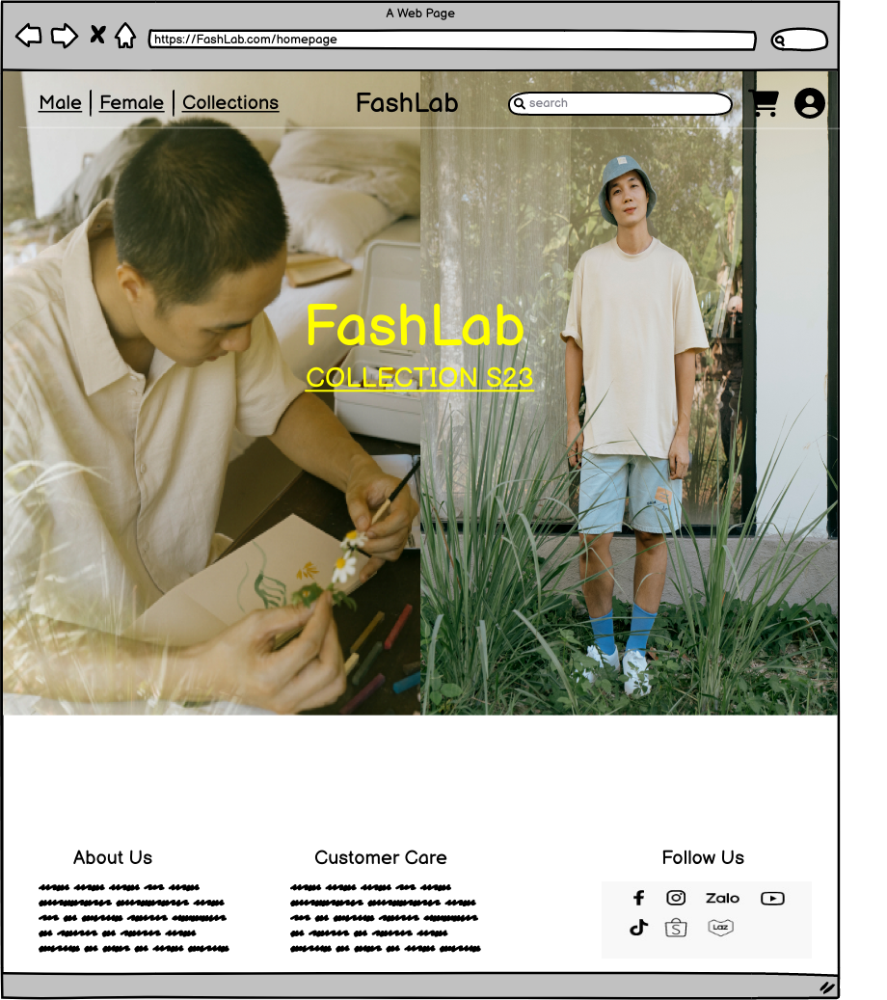
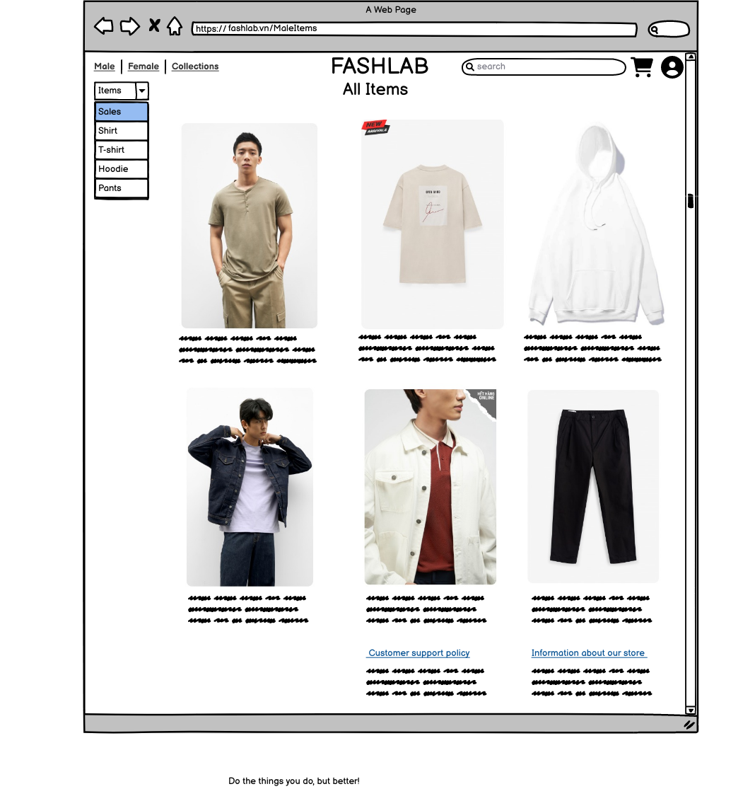
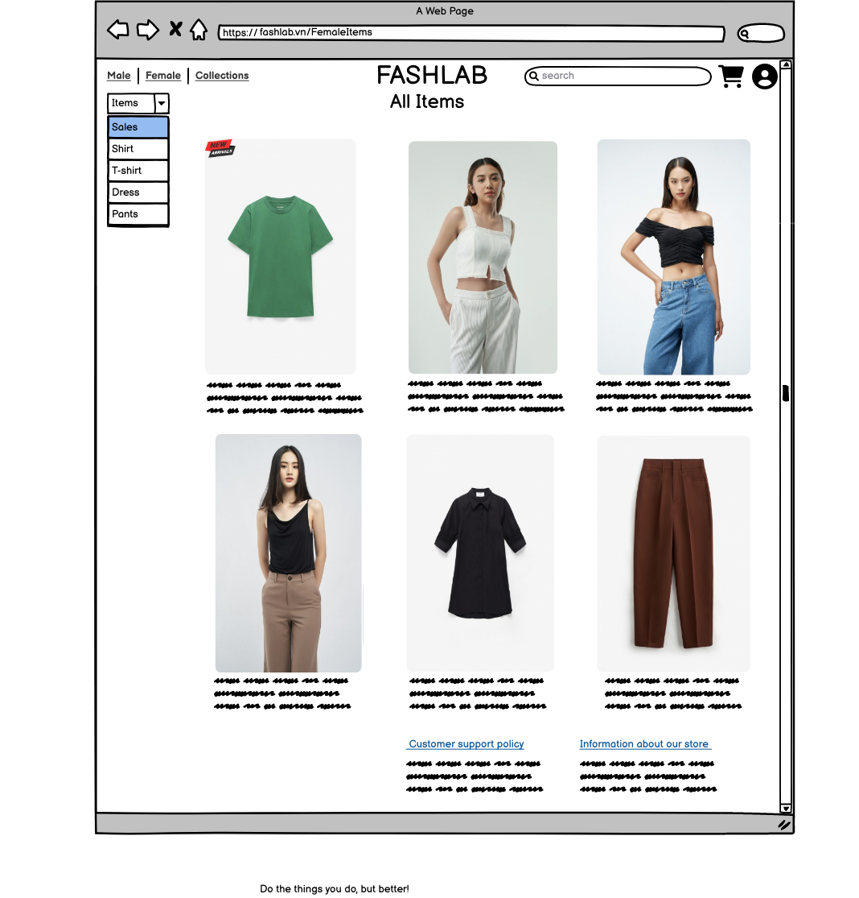
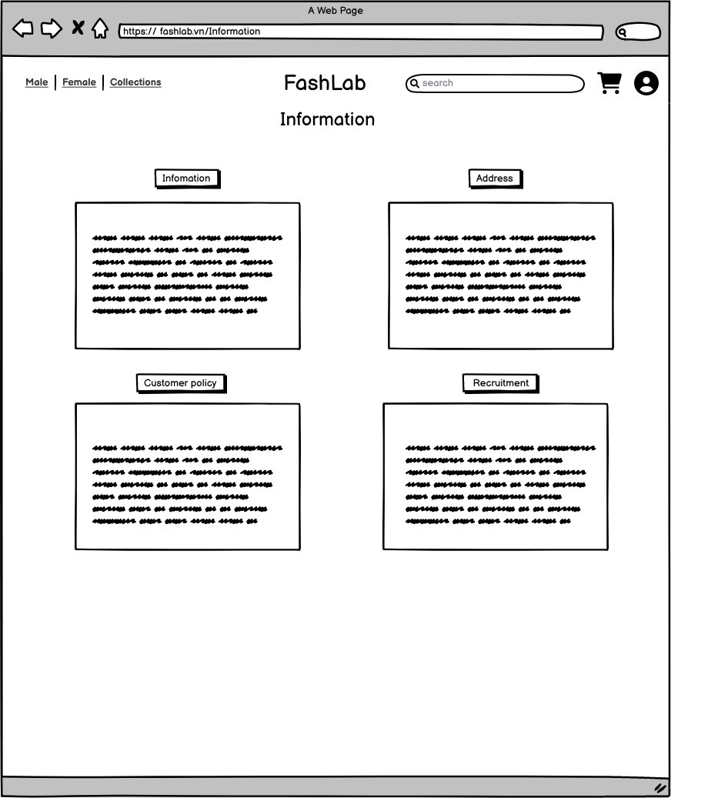
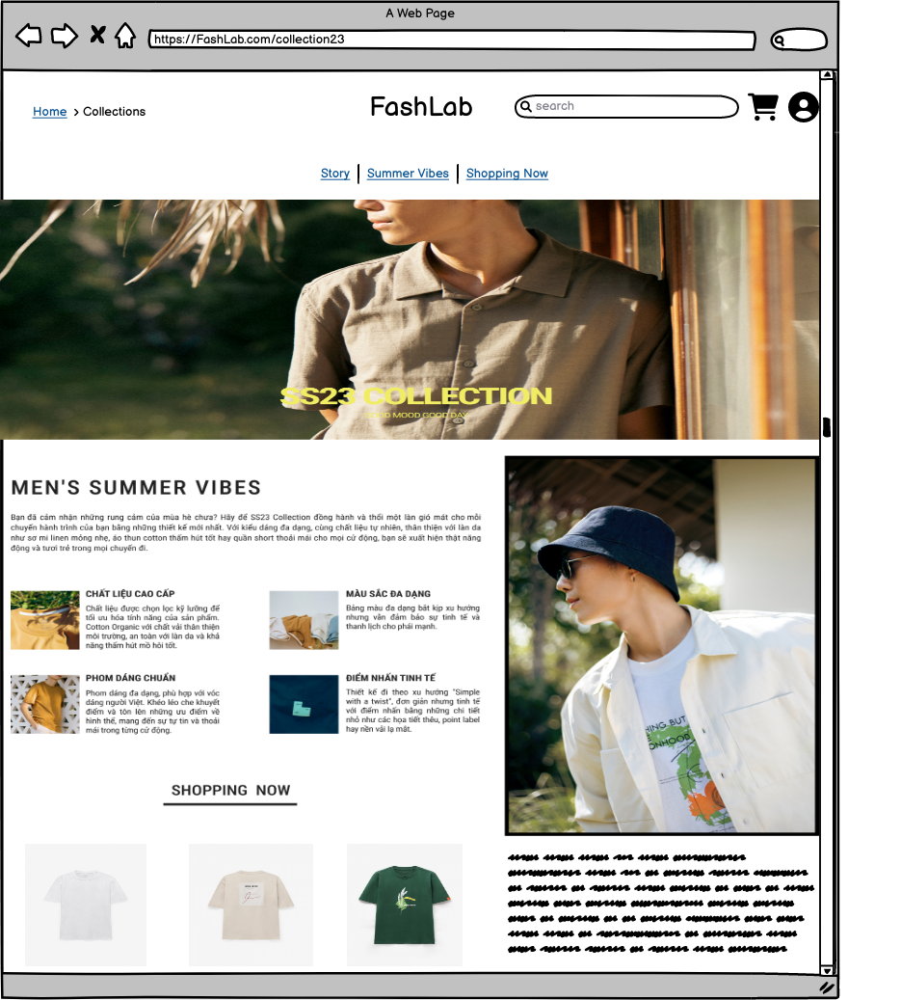
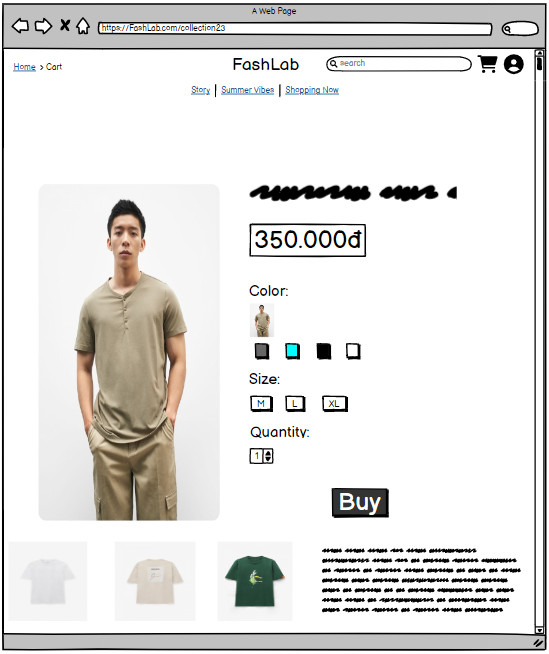

# FashLab - Assigment PRJ301
## Table of Contents
1. [Requirement](#Requirement)
2. [Design](#Design)
## Team Members
| Name  | ID  |
|---|---|
| Đỗ Nguyễn Bảo Tâm | SE173314 |
| Nguyễn Trần Đức Lương | SE160893 |
| Phạm Phi Nguyễn | SE161566 |
| Nguyễn Hà Thanh Mai | SE171497 |
## Requirement
### Name of the system
FashLab
### Purpose of the system
FashLab is an online clothing store which the goal is to provide customers with a convenient and accessible way to shop for clothes from the comfort of their own homes. Online clothing stores offer a wide range of products to choose from, with the ability to browse through different categories, styles, and sizes at any time. Customers can easily compare prices and products from multiple stores, read reviews from other customers, and make informed decisions about their purchases.
### Who use the system
FashLab are used by a diverse range of individuals, including:
1. Busy individuals who don't have the time to go to a physical store to shop for clothes.
2. People who live in rural areas where access to physical clothing stores is limited.
3. Shoppers who are looking for a wider range of options and sizes than what is available in their local stores.
4. Fashion enthusiasts who are interested in the latest trends and styles from around the world.
5. Budget-conscious shoppers who are looking for deals and discounts.
6. People who have mobility or transportation issues that make it difficult to visit physical stores.
7. Consumers who prefer the convenience of shopping from home, without the crowds and long lines of physical stores.
8. International shoppers who are interested in buying clothes from brands that are not available in their country.
### Features
- Customer can create account / log in to the website to purchase and view the order.
- Search item by name, category like shirt, pants, male clothes, female clothes.
- Sort products by category like shirt, pants, male clothes, female clothes.
- Users can access to the item detail to view the price, color, size.
- Recommendations by category, when the user is viewing a shirt the other items with the same category (shirt) will appear in the recommedations section.
## Design
### **SiteMap**

### **Wireframe**

  
  
  

  
  
  

### **Database**
